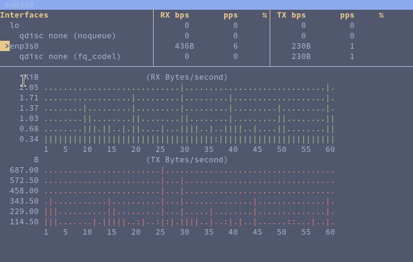
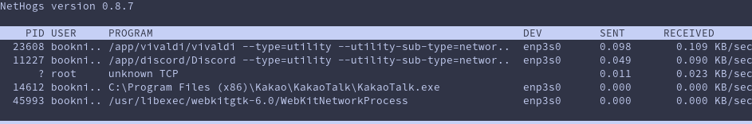
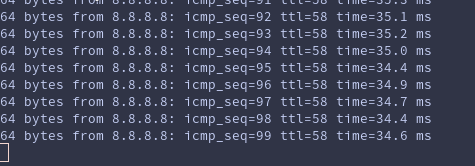

# Checking for Ethernet Network Congestion

This guide walks you through the process of identifying and diagnosing potential network congestion issues on your Ethernet connection using bmon, nethogs, ping, and mtr.

## Table of Contents
1. [Identify the Ethernet Interface](#1-identify-the-ethernet-interface)
2. [Monitor Real-time Network Usage (bmon)](#2-monitor-real-time-network-usage-bmon)
3. [Identify Bandwidth-Heavy Processes (nethogs)](#3-identify-bandwidth-heavy-processes-nethogs)
4. [Check for Packet Loss (ping)](#4-check-for-packet-loss-ping)
5. [Measure Network Latency (mtr)](#5-measure-network-latency-mtr)

## 1. Identify the Ethernet Interface

First, we need to identify the Ethernet interface. Use the `ifconfig` or `ip address` command:

```bash
ip a
```

Look for an interface that starts with "eth" or "enp". For example, "eth0" or "enp0s3".

My setup looks something like this:

```bash
booknite@fedora:~$ ip a
1: lo: <LOOPBACK,UP,LOWER_UP> mtu 65536 qdisc noqueue state UNKNOWN group default qlen 1000
    link/loopback 00:00:00:00:00:00 brd 00:00:00:00:00:00
    inet 127.0.0.1/8 scope host lo
       valid_lft forever preferred_lft forever
    inet6 ::1/128 scope host noprefixroute 
       valid_lft forever preferred_lft forever
2: enp3s0: <BROADCAST,MULTICAST,UP,LOWER_UP> mtu 1500 qdisc fq_codel state UP group default qlen 1000
    link/ether 88:d7:f6:df:b0:83 brd ff:ff:ff:ff:ff:ff
    inet 211.194.81.243/26 brd 211.194.81.255 scope global dynamic noprefixroute enp3s0
       valid_lft 2191sec preferred_lft 2191sec
    inet6 fe80::d231:47db:2ba8:e4b1/64 scope link noprefixroute 
       valid_lft forever preferred_lft forever
```

I removed my actual network information for privacy reasons.

You can see that the connections are 'lo' and 'enp3s0'

The lo interface is the loopback interface. It's a virtual network interface that your computer uses to communicate with itself. We won't need to worry about that right now.

For ethernet interfaces, we're looking for names like eth0, eth1, etc. (usually with older systems), or enp.

In my case, my IP address is assigned to enp3s0.

- en: Ethernet
- p3: PCI bus 3
- s0: slot 0

Other common prefixes you might see are:

- wl: Wireless LAN (Wi-Fi)
- ww: Wireless WAN (like cellular data)
- br: Bridge interfaces
- tun or tap: Virtual tunnel interfaces

## 2. Monitor Real-time Network Usage (bmon)

bmon provides a real-time view of network usage. Unexpected, high, and sustained usage might indicate congestion.

Install bmon:
- Fedora: `sudo dnf install bmon`
- Debian/Ubuntu: `sudo apt install bmon`

Run bmon:
```bash
bmon
```



RX: Received data
TX: Transmitted data

## 3. Identify Bandwidth-Heavy Processes (nethogs)

Maybe your internet is slow because of a program running in the background, or something is hogging the bandwidth. Let's check.

Install nethogs:
- Fedora: `sudo dnf install nethogs`
- Debian/Ubuntu: `sudo apt install nethogs`

Run nethogs (replace enp3s0 with your interface name):
```bash
sudo nethogs enp3s0
```



Here we can see which programs are using the most bandwidth.

## 4. Check for Packet Loss (ping)

Ping a DNS server to check if any packets are getting dropped.

```bash
ping -c 100 8.8.8.8 
```

Here, we're pinging Google's DNS server 100 times. Packet loss of 1~2% could indicate congestion.



All 100 packets were received. Nice. 

Typical Ping Times:

Local Network (LAN):
- Excellent: < 1 ms
- Good: 1-5 ms
- Acceptable: 5-10 ms

Broadband Internet (same country/region):
- Excellent: < 20 ms
- Good: 20-50 ms
- Acceptable: 50-100 ms

Long Distance (cross-continent):
- Excellent: < 100 ms
- Good: 100-150 ms
- Acceptable: 150-200 ms

Satellite Internet:
- Typical: 500-800 ms

My ping times were 34-35 ms on average. This is pretty good, especially since here in Korea, I'm not geographically close to Google's servers.

For reference, 100 ms or lower will be perfectly suitable for web browsing, online gaming is best around 50ms or lower, and video calls don't enter the danger zone until about 150 ms or more.

## 5. Measure Network Latency (mtr)

mtr combines ping and traceroute. It shows the route to Google's DNS and the latency at each hop. High latency or a bunch of hops with high packet loss suggests network issues.

Install mtr (most distros will have this out of the box):
- Fedora: `sudo dnf install mtr`
- Debian/Ubuntu: `sudo apt install mtr`

Run mtr:
```bash
mtr 8.8.8.8
```


Again, 0% packet loss is fantastic, and 9 hops isn't bad either (for a DNS server so far away). Generally, fewer is better.

For reference:
- Local network:  1-3 hops
- Cross-country:  10-15 hops
- International:  20+ hops

In our case, 9 hops is quite efficient.

My network is fine right now, but these are some ways to check if you're ever experiencing some slowdowns.
